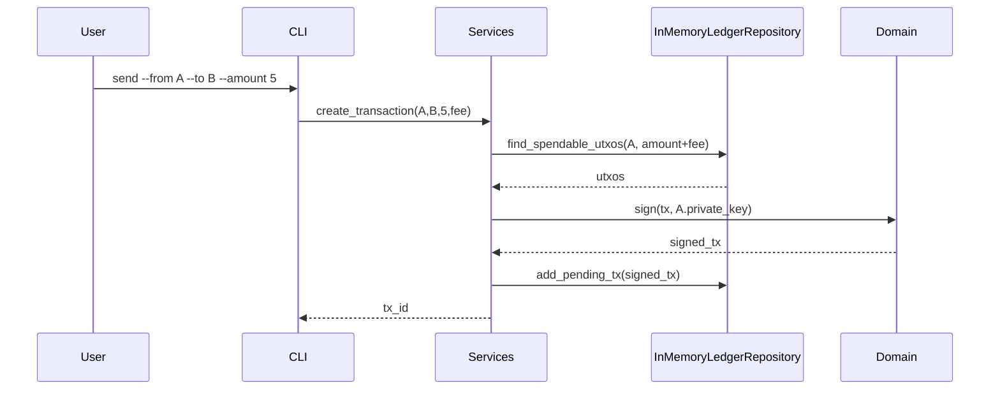
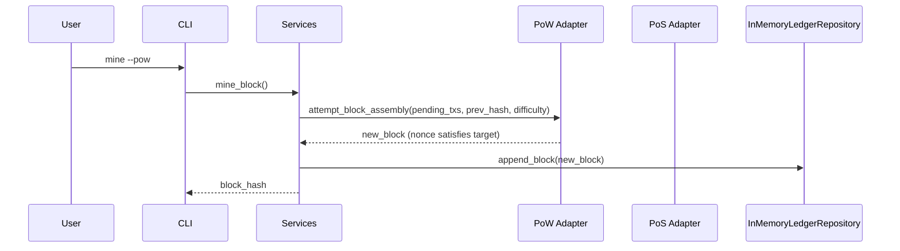

# Crypto Wallet Simulator

A **console-first, educational** crypto wallet simulator that mirrors key ideas from real wallets (MetaMask, Exodus) and public blockchains (Bitcoin/Ethereum) **without** depending on live networks. It focuses on **public‑key cryptography**, **digital signatures**, **UTXO‑like transactions**, and **swappable consensus** (PoW vs Mock PoS) on an **in‑memory ledger**.

> Goal: Make core blockchain/wallet mechanics _clear, testable, and sustainable_ for learners—no RPC nodes or external APIs required.

---

## Table of Contents

- [Why Simulate (Rationale)](#why-simulate-rationale)
- [Key Features](#key-features)
- [Architecture](#architecture)
  - [Layered Overview (DDD + Ports & Adapters)](#layered-overview-ddd--ports--adapters)
  - [Folder Structure](#folder-structure)
  - [Domain Model](#domain-model)
  - [Data & Control Flows](#data--control-flows)
- [Consensus Modes](#consensus-modes)
- [CLI Usage](#cli-usage)
- [Installation & Setup](#installation--setup)
- [Quickstart](#quickstart)
- [Testing Strategy](#testing-strategy)
- [Design Decisions](#design-decisions)
- [Sustainability Notes](#sustainability-notes)
- [Roadmap](#roadmap)
- [Glossary](#glossary)
- [License](#license)

---

## Why Simulate (Rationale)

- **Safety & Simplicity:** Real wallets require network/API integrations, key management UX, and security hardening. A simulator keeps the scope safe and understandable.
- **Pedagogy:** Demonstrates how **public/private keys** secure ownership, how **digital signatures** authorize spending, and how **ledgers** enforce integrity and consensus.
- **Experimentation:** Swap **Proof of Work (PoW)** and **Mock Proof of Stake (PoS)** to compare trade‑offs (security, energy, latency) using the **same domain rules**.
- **Sustainability:** In‑memory blocks + mock validators = near‑zero energy vs. real mining.

---

## Key Features

- **Key generation** (e.g., ECDSA over secp256k1) and **address derivation** (hashing & encoding).
- **Transaction model**: inputs/outputs (UTXO‑like), signatures, fee calculation, and basic validation.
- **In‑memory blockchain**: blocks, headers, and a chain store (no external node).
- **Pluggable consensus**: switch between `ProofOfWorkAdapter` and `MockProofOfStakeAdapter`.
- **Balance tracking**: derive spendable UTXOs/address balances.
- **Deterministic, fast tests** with clean boundaries.
- **Console CLI**: create wallets, send funds, mine/validate, inspect chain state.

> _Scope_: Console-based by default. A simple GUI may be added as a separate entrypoint without touching core rules.

---

## Architecture

### Layered Overview (DDD + Ports & Adapters)

Core business logic (domain) is isolated from runtime concerns (consensus, persistence, UI).

```mermaid
flowchart TD
  subgraph Entrypoints (Primary Adapters)
    CLI([CLI Simulator])
  end

  subgraph Service Layer (Application)
    SVC[Use Cases / Services]
    UOW[Unit of Work]
    BUS[Message Bus (optional)]
  end

  subgraph Domain (Core)
    ENT[Entities & Value Objects]
    RULES[Validation & Domain Services]
  end

  subgraph Adapters (Secondary)
    PERS[(In-Memory Ledger Repository)]
    POW[[PoW Adapter]]
    POS[[Mock PoS Adapter]]
  end

  CLI --> SVC
  SVC <---> UOW
  SVC <---> BUS
  SVC --> ENT
  ENT <---> RULES
  SVC --> PERS
  SVC --> POW
  SVC --> POS
```

### Folder Structure

```
/crypto_simulator_project
├── src/
│   ├── domain/
│   │   ├── __init__.py
│   │   ├── model.py         # Wallet, Address, UTXO, TxIn/TxOut, Transaction, Block, BlockHeader
│   │   ├── exceptions.py    # InvalidSignature, InsufficientFunds, DoubleSpend, InvalidTx, etc.
│   │   └── messages.py      # Domain events/commands (e.g., TxCreated, BlockMined)
│   │
│   ├── service_layer/
│   │   ├── __init__.py
│   │   ├── services.py      # Use cases: create_wallet, create_tx, submit_tx, mine_block, stake_block
│   │   ├── unit_of_work.py  # AbstractUoW + InMemoryUoW; transactional boundary
│   │   └── message_bus.py   # Optional event routing (e.g., on TxSubmitted -> maybe mine)
│   │
│   ├── adapters/
│   │   ├── __init__.py
│   │   ├── persistence.py   # AbstractRepository + InMemoryLedgerRepository
│   │   └── consensus.py     # ProofOfWorkAdapter, MockProofOfStakeAdapter
│   │
│   └── entrypoints/
│       ├── __init__.py
│       └── cli_simulator.py # Argparse/Typer-based CLI
│
└── tests/
    ├── unit/
    ├── integration/
    └── e2e/
```

### Domain Model

**Entities & Value Objects**
- `Wallet` (owns `private_key`, `public_key`, `address`)
- `Address` (hash-based identifier derived from public key)
- `UTXO` (id, amount, owner address, lock script/conditions—simplified)
- `Transaction` (list of `TxIn` referencing UTXOs + list of `TxOut` and `signature(s)`)
- `BlockHeader` (prev_hash, merkle_root, timestamp, nonce, difficulty/validator_id)
- `Block` (header + transactions)
- `Chain` (append-only sequence with validation and best-tip selection)

**Core Rules**
- Address ownership proven by **digital signature** (verify(pubkey, message, signature)).
- Inputs must reference **unspent** outputs; otherwise **DoubleSpend**.
- Sum(inputs) ≥ Sum(outputs) + fee; else **InvalidTx**.
- Block validity: header integrity, tx validity, merkle root check, consensus conditions.

### Data & Control Flows

**Create & submit transaction**


**Mine (PoW) or Validate (PoS)**


---

## Consensus Modes

### Proof of Work (PoW)

- Adjustable `difficulty` (number of leading zeros / target threshold).
- Miner iterates `nonce` until `hash(header) < target`.
- Educational only: no real energy use; keep difficulty low.

_Pseudocode_
```python
while True:
    header.nonce += 1
    h = hash(header.bytes())
    if h < target:
        return Block(header=header, txs=selected_txs)
```

### Mock Proof of Stake (PoS)

- Choose a validator proportional to stake (address balance).
- Optionally require a **verifiable random** seed (deterministic for tests).
- Validator signs block header; no nonce loop.

_Pseudocode_
```python
validator = weighted_random(addresses, weights=stakes)
header.validator_id = validator
header.signature = sign(validator_priv, header_digest)
return Block(header=header, txs=selected_txs)
```

---

## CLI Usage

> The CLI is the **primary entrypoint**. Below uses `python -m src.entrypoints.cli_simulator` as an example.

### Help
```bash
python -m src.entrypoints.cli_simulator --help
```

### Create wallets
```bash
python -m src.entrypoints.cli_simulator wallet create --label alice
python -m src.entrypoints.cli_simulator wallet create --label bob
```

### Faucet (genesis or educator airdrop)
```bash
python -m src.entrypoints.cli_simulator faucet --to bob --amount 50
```

### Send funds
```bash
python -m src.entrypoints.cli_simulator tx send \
  --from alice --to bob --amount 10 --fee 1
```

### Mine (PoW) or Validate (PoS)
```bash
# PoW
python -m src.entrypoints.cli_simulator chain mine --pow --difficulty 4

# Mock PoS
python -m src.entrypoints.cli_simulator chain validate --pos
```

### Inspect state
```bash
python -m src.entrypoints.cli_simulator chain tip
python -m src.entrypoints.cli_simulator wallet balance --label bob
python -m src.entrypoints.cli_simulator mempool list
python -m src.entrypoints.cli_simulator chain blocks --last 5
```

---

## Installation & Setup

**Requirements**
- Python 3.10+
- `pipx` or `pip` (recommended `pipx` for isolated CLI installs)
- (Optional) `poetry` for dependency management

**Steps**
```bash
git clone <your-repo-url> crypto_simulator_project
cd crypto_simulator_project

# (Option A) venv + pip
python -m venv .venv && source .venv/bin/activate
pip install -U pip
pip install -e .  # if you add a pyproject.toml / setup.cfg

# (Option B) poetry
poetry install
poetry run python -m src.entrypoints.cli_simulator --help
```

> Cryptography backend: you can start with Python's `hashlib` for hashing and a minimal ECDSA lib (e.g., `ecdsa`) for signatures. Keep adapters isolated so you can swap libs later.

---

## Quickstart

```bash
# 1) Create wallets
python -m src.entrypoints.cli_simulator wallet create --label alice
python -m src.entrypoints.cli_simulator wallet create --label bob

# 2) Give Alice some funds (educational faucet)
python -m src.entrypoints.cli_simulator faucet --to alice --amount 100

# 3) Alice sends Bob 10 (fee 1)
python -m src.entrypoints.cli_simulator tx send \
  --from alice --to bob --amount 10 --fee 1

# 4) Confirm by PoW mining
python -m src.entrypoints.cli_simulator chain mine --pow --difficulty 3

# 5) Check balances
python -m src.entrypoints.cli_simulator wallet balance --label alice
python -m src.entrypoints.cli_simulator wallet balance --label bob
```

Expected: balances update after the block is appended; mempool clears for included txs.

---

## Testing Strategy

- **Unit tests (`tests/unit/`)**
  - Signature verify/invalid cases
  - UTXO selection & fee logic
  - Merkle root calculation
- **Integration tests (`tests/integration/`)**
  - `services.py` with `InMemoryUoW` + `InMemoryLedgerRepository`
  - Consensus adapter boundaries (mock PoW/PoS)
- **End-to-end (`tests/e2e/`)**
  - Full CLI scenario: faucet → send → mine/validate → assert balances & chain height

```bash
pytest -q
```

---

## Design Decisions

1. **DDD + Ports/Adapters**
   - Keeps domain pure; enables swapping consensus/persistence without touching rules.
2. **In-memory persistence**
   - Zero external dependencies; fast tests; deterministic e2e runs.
3. **UTXO model**
   - Concrete mapping to Bitcoin whitepaper’s inputs/outputs makes ownership & fees explicit.
4. **Explicit Unit of Work**
   - Transactional boundary for service operations—even with in-memory state—improves clarity.
5. **Message bus (optional)**
   - Decouples events like "TxSubmitted" → "ConsiderMining"; can be omitted for minimalism.
6. **Deterministic Mock PoS**
   - Allows reproducible tests; avoids real randomness unless explicitly requested.

---

## Sustainability Notes

- **PoW difficulty** defaults low for classroom use.
- Prefer **Mock PoS** in demos to illustrate energy savings vs PoW.
- No network calls, no RPC; minimal CPU usage.

---

## Roadmap

- [ ] Simple GUI entrypoint (Tkinter or Textual) mirroring CLI commands
- [ ] HD wallet support (BIP‑32/39/44‑inspired, educational—not production)
- [ ] Script conditions (time locks, multisig) in simplified form
- [ ] Pluggable storage (SQLite adapter) while keeping the domain untouched
- [ ] JSON import/export of chain state for reproducible labs
- [ ] Deterministic fixtures for lecture slides

---

## Glossary

- **Address**: Hash/encoding of a public key used as a receiver identifier.
- **UTXO**: Unspent Transaction Output—discrete spendable coin units.
- **Mempool**: Set of pending (unconfirmed) transactions.
- **Block**: A batch of transactions + header containing metadata and consensus proof.
- **Consensus**: Mechanism to agree on the next valid block (PoW, PoS).
- **Unit of Work**: Pattern defining transactional scope for use cases.

---

## License

This project is for educational purposes. Choose a permissive license (e.g., MIT/Apache‑2.0) or add proprietary terms as needed.